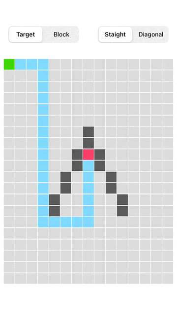

# JDAStar

[](https://cocoapods.org/pods/JDAStar)
[](https://cocoapods.org/pods/JDAStar)
[](https://cocoapods.org/pods/JDAStar)

A simple path finding library based on the A*(A-Star) algorithm.



## Example

To run the example project, clone the repo, and run `pod install` from the Example directory first.

## Requirements

- iOS 9.0+
- macOS 11.0+
- Swift 4.0+

## Installation

JDAStar is available through [CocoaPods](https://cocoapods.org). To install
it, simply add the following line to your Podfile:

```ruby
source 'https://github.com/CocoaPods/Specs.git'
pod 'JDAStar'
```
## Usage

```Swift
var starTrek: JDAStarTrek?

// JDAStarNode contains properties col, row, idx
var pathNodes = [JDAStarNode]()

// Initialize map size and path mode
starTrek = JDAStarTrek(cols: 15, rows: 26, isDiagonalEnable: false)

// Dianymically set size and path mode
starTrek?.setMapSize(cols: 23, rows: 40)
starTrek?.isDiagonalEnabled = true
```

Find path by indexes

```Swift
if let pn = starTrek?.findPath(startIndex: 0,
                               endIndex: 72,
                               blockIndexes: [6, 12]) {
    pathNodes = pn
}
```

Find path by positions

```Swift
if let pn = starTrek?findPath(startPosition: AStarPosition(col: 0, row: 0),
                                endPosition: AStarPosition(col: 7, row: 12), 
								blockPosition: []) {
	pathNodes = pn
}
```
## License

JDAStar is available under the MIT license. See the LICENSE file for more info.
